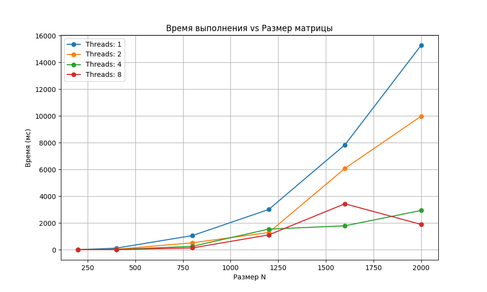
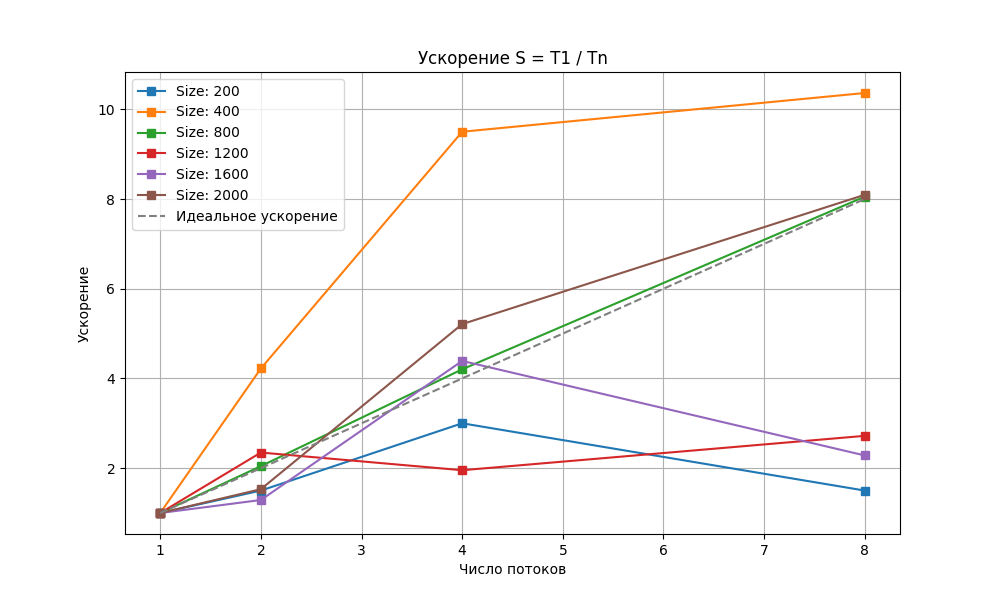

# Лабораторная работа №2. Параллельное умножение матриц (OpenMP)

## Задание
* Модифицировать последовательную программу из ЛР №1 для параллельной работы по технологии **OpenMP**.
* Провести эксперименты с разным количеством потоков (1, 2, 4, 8) и разными размерами матриц (200 - 2000).
* Исследовать зависимость времени выполнения, ускорения и эффективности от параметров распараллеливания.

## Реализация и теоретические сведения
Для распараллеливания алгоритма использована технология **OpenMP**. Основной областью параллелизма стал внешний цикл вычислений (по строкам). 

В программе реализован динамический выбор количества потоков через переменную окружения `OMP_NUM_THREADS`. Сохранен оптимизированный порядок обхода памяти **i-k-j**, что позволяет минимизировать промахи кэша при работе нескольких потоков одновременно.

---

## 📊 Результаты экспериментов

| Размер (N) | 1 поток (мс) | 2 потока (мс) | 4 потока (мс) | 8 потоков (мс) | Ускорение (max) |
| :--- | :--- | :--- | :--- | :--- | :--- |
| **200** | 6.00 | 4.00 | 2.00 | 4.00 | 3.0x |
| **400** | 114.00 | 27.00 | 12.00 | 11.00 | 10.3x |
| **800** | 1055.00 | 516.00 | 251.00 | 131.00 | 8.0x |
| **1200** | 3003.00 | 1279.00 | 1537.00 | 1104.00 | 2.7x |
| **1600** | 7833.00 | 6073.00 | 1784.00 | 3431.00 | 4.3x |
| **2000** | 15274.00 | 9976.00 | 2931.00 | 1887.00 | **8.1x** |

---

## 📈 Визуализация производительности

### Зависимость времени от размера и числа потоков

### Анализ ускорения (Speedup)

---

## Анализ и выводы
1. **Эффективность распараллеливания:** На максимальной размерности (2000x2000) достигнуто ускорение в **8.1 раз**. Это подтверждает, что задача умножения матриц отлично масштабируется на многоядерных системах.
2. **Закон Амдала:** На малых размерностях (N=200) ускорение практически отсутствует из-за накладных расходов на создание и синхронизацию потоков. С ростом объема задачи эффективность параллелизма растет.
3. **Влияние архитектуры:** Флуктуации времени на средних размерах (1200, 1600) связаны с конкуренцией потоков за общую кэш-память L3 и влиянием планировщика операционной системы.
4. **Масштабируемость:** Использование 8 потоков на больших матрицах дает стабильный прирост производительности относительно 1 и 2 потоков.

---

## Инструкция по запуску
1. Скомпилировать: `g++ -O3 -fopenmp src/main.cpp -o matmul_omp.exe`
2. Запустить тесты: `python scripts/verify.py`