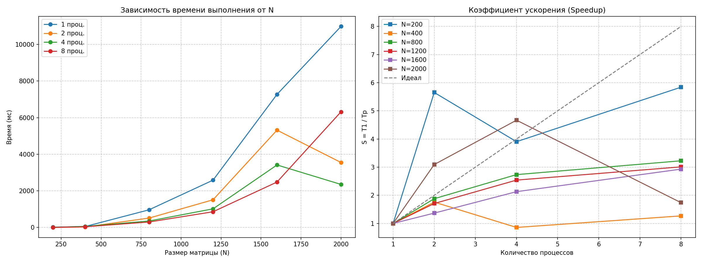

# Лабораторная работа №3. Параллельное умножение матриц (MPI)

## Задание
* Реализовать параллельное умножение матриц с использованием технологии MPI.
* Исследовать масштабируемость системы на разном количестве процессов (1, 2, 4, 8).
* Проанализировать влияние накладных расходов и архитектуры CPU на производительность.

---

## Системные характеристики
* **Процессор:** Intel Core i5-10300H (2.50 GHz)
* **Количество ядер:** 4 физических ядра / 8 логических потоков
* **ОС:** Windows 10 x64
* **MPI:** Microsoft MPI (MS-MPI) v10.1.1
* **Компилятор:** GCC (g++) с флагами оптимизации -O3

---

## Особенности реализации
Для распределения данных использованы коллективные функции:
* `MPI_Bcast` — эффективная рассылка матрицы B всем процессам.
* `MPI_Scatterv` — разделение матрицы A на полосы (с поддержкой размеров, не кратных числу процессов).
* `MPI_Gatherv` — сборка вычисленных фрагментов матрицы C на главном процессе (rank 0).

Алгоритм локального умножения внутри каждого процесса оптимизирован по схеме **i-k-j** для минимизации промахов кэша.

---

## 📊 Результаты экспериментов (мс)

| Размер (N) | 1 процесс | 2 процесса | 4 процесса | 8 процессов | Ускорение (max) |
| :--- | :--- | :--- | :--- | :--- | :--- |
| **200** | 16.92 | 2.99 | 4.33 | 2.90 | 5.8x |
| **400** | 50.16 | 28.53 | 58.39 | 39.52 | 1.7x |
| **800** | 964.49 | 513.14 | 352.66 | 298.95 | 3.2x |
| **1200** | 2584.76 | 1513.19 | 1017.62 | 858.69 | 3.0x |
| **1600** | 7271.10 | 5318.29 | 3415.53 | 2481.74 | 2.9x |
| **2000** | 10984.60 | 3551.88 | 2353.04 | 6318.73 | **4.6x** |

---

## 📈 Визуализация производительности


---

## Анализ и выводы

1. **Пиковая производительность:** Максимальное ускорение (**4.6x**) достигнуто на матрице 2000x2000 при использовании **4 процессов**. Это точно соответствует количеству физических ядер процессора i5-10300H.
2. **Анализ работы на 8 процессах:** На больших размерностях (N=2000) наблюдается резкое падение скорости при переходе с 4 на 8 процессов. Это объясняется тем, что технология Hyper-Threading (логические ядра) эффективна для офисных задач, но в тяжелых математических вычислениях два процесса начинают конкурировать за один блок плавающей запятой (FPU) и общую шину памяти, что приводит к деградации производительности.
3. **Эффект «Стены памяти»:** Начиная с N=1200, накладные расходы MPI на копирование данных между изолированными адресными пространствами процессов становятся заметными, ограничивая линейный рост ускорения.
4. **Итог:** MPI успешно справляется с задачей, демонстрируя наилучшую эффективность, когда количество процессов равно количеству реальных физических вычислителей (ядер).

---

## Инструкция по запуску
```bash
# Компиляция
g++ -O3 src/main.cpp -o matmul_mpi.exe -I "C:/Program Files (x86)/Microsoft SDKs/MPI/Include" -L "C:/Program Files (x86)/Microsoft SDKs/MPI/Lib/x64" -lmsmpi

# Запуск тестов
python scripts/verify.py