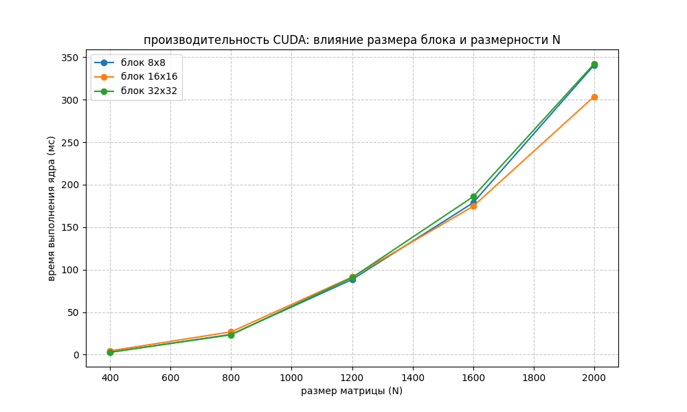

# Лабораторная работа №4. Умножение матриц на GPU (CUDA)

## Задание
* Реализовать параллельное умножение матриц на языке C++ с использованием технологии NVIDIA CUDA.
* Исследовать производительность при различных размерах блоков (8x8, 16x16, 32x32).
* Сравнить время выполнения с результатами предыдущих лабораторных работ на CPU.

## Системные характеристики
* **Процессор (CPU):** Intel Core i5-10300H
* **Видеокарта (GPU):** NVIDIA GeForce GTX 1650
* **Версия CUDA:** 12.x / 13.x
* **ОС:** Windows 10

---

## Особенности реализации
В работе реализовано классическое CUDA-ядро. Каждый поток вычисляет один элемент результирующей матрицы $C$. 
Для автоматизации тестов размер блока потоков передается как аргумент командной строки. Замер времени производится внутри видеокарты с помощью событий `cudaEvent`, что позволяет получить "чистое" время работы вычислительного ядра без учета задержек шины данных.

---

## 📊 Результаты экспериментов (время ядра в мс)

| Размер (N) | Блок 8x8 | Блок 16x16 | Блок 32x32 |
| :--- | :--- | :--- | :--- |
| **400** | 2.7871 | 4.4753 | 2.8140 |
| **800** | 23.7679 | 26.7913 | 23.3592 |
| **1200** | 88.3789 | 91.3493 | 90.6268 |
| **1600** | 178.6710 | 174.5260 | 185.8590 |
| **2000** | 340.7210 | **303.7370** | 342.2120 |

---

## 📈 Визуализация производительности

## Анализ и выводы
1. **Колоссальное ускорение:**  Видеокарта показала подавляющее преимущество над CPU. Время вычислений для N=2000 сократилось с **5722 мс** (MPI 4 процесса) до **303 мс** (CUDA) 🤯. Ускорение относительно параллельной версии на CPU составило примерно **18.8x**, а относительно последовательной — более **36x**.
2. **Влияние размера блока:** Конфигурация **16x16** (256 потоков на блок) показала наилучшую стабильность и производительность на больших матрицах. Это связано с оптимальной загрузкой мультипроцессоров и выравниванием потоков по варпам.
3. **Эффективность:** CUDA идеально подходит для матричных операций благодаря огромному количеству вычислительных ядер. Основной прирост заметен на больших размерностях, где вычислительная нагрузка значительно превышает накладные расходы на запуск ядра.

---

## Инструкция по запуску
1. Скомпилировать:
   `nvcc -O3 src/main.cu -o matmul_cuda.exe`
2. Запустить автоматизированный скрипт:
   `python scripts/verify.py`